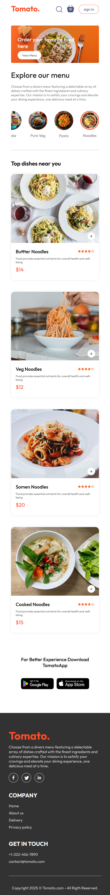

# Tomato Delivery App (Frontend)

A simple and easy to use Food Delivery application (**frontend-only**) built with **React** and **Vite** that allows users to can view the menu, filter dishes by category, the shopping cart functionality so that user can add the required quantity food items in their cart and order food from this app.

Application has the user authentication system so that anyone can create an account and login this food order website.

## Features

- Browse the menu with different dish categories
- Filter dishes by category
- Shopping cart functionality with quantity control
- Place orders through the cart interface
- User registration and login system

## Deployment

This React (Vite) pet project deployed on **Vercel**.

[View on Vercel](https://tomato-delivery-sepia.vercel.app/)

## Screenshots

| Desktop                                          | Mobile                                         |
| ------------------------------------------------ | ---------------------------------------------- |
|  |  |

## Tech Stack

- **React**: JavaScript library for building user interfaces.
- **Vite**: Next-generation front-end tooling for fast development.
- **JavaScript (ES6+)**: Programming language.
- **CSS**: Styling (using CSS Custom Properties included @keyframes).

## Getting Started

### 1. Clone the Repository

If you're setting this up from a cloned repository:

```bash
git clone https://github.com/LenaM777/tomato-delivery.git
cd frontend
```

### 2. Install Dependencies

Navigate to the project directory and install the required npm packages:

```bash
npm install
# or
# yarn install
```

### 3. Run the Development Server

Once the dependencies are installed and the environment variable is set, you can start the development server:

```bash
npm run dev
# or
# yarn dev
```

This will usually start the app on `http://localhost:5173`. Open this URL in your web browser to see the application.

## Project Structure

```plaintext
tomato-delivery/
└── frontend/
├── public/
│ └── index.html
├── src/
│ ├── assets/
│ ├── components/
│ │ ├── AppDownload/ AppDownload.jsx, AppDownload.css
│ │ ├── ExploreMenu/ ExploreMenu.jsx, ExploreMenu.css
│ │ ├── FoodDisplay/ FoodDisplay.jsx, FoodDisplay.css
│ │ ├── FoodItem/ FoodItem.jsx, FoodItem.css
│ │ ├── Footer/ Footer.jsx, Footer.css
│ │ ├── Header/ Header.jsx, Header.css
│ │ ├── LoginPopup/ LoginPopup.jsx, LoginPopup.css
│ │ └── Navbar/ Navbar.jsx, Navbar.css
│ ├── context/ StoreContext.jsx
│ ├── pages/
│ │ ├── Cart/ Cart.jsx, Cart.css
│ │ ├── Home/ Home.jsx, Home.css
│ │ └── PlaceOrder/ PlaceOrder.jsx, PlaceOrder.css
│ ├── styles/ variables.css
│ ├── App.jsx
│ ├── index.css
│ └── main.jsx
├── .gitkeep
├── .gitignore
├── README.md
├── eslint.config.js
├── package.json
├── package-lock.json
└── vite.config.js
```

## How It Works

- The `App` component manages the main state, including the current user authentication status, the list of food items, the selected category filter, and the shopping cart contents.
- The `LoginPopup` component handle user authentication, allowing users to create an account and log in.
- The `ExploreMenu` component displays food items and allows filtering by category via user interaction.
- When a user selects a category or searches, the `App` updates the displayed list of dishes accordingly.
- The `FoodItem` components let users select quantities and add items to the shopping cart.
- The `Cart` component manages the shopping cart state, allowing users to increase, decrease, or remove items, and displays the total price.
- Upon order confirmation, the app processes the order (frontend only; backend integration can be added later).
- All relevant state is managed using React Context API, implemented via the custom StoreContext in the src/context/folder.
